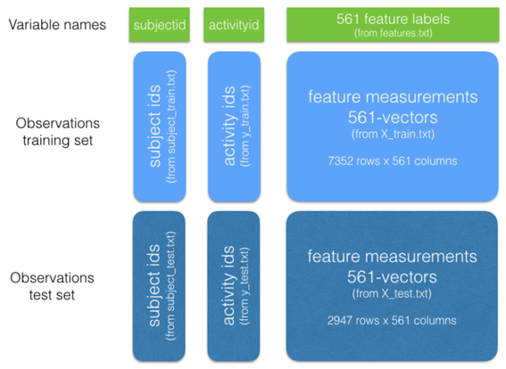

## Data File Details
An experiment with 30 volunteers performing activities of daily living (ADL) while carrying a waist-mounted smartphone with embedded inertial sensors was carried out.  These volunteers were within an age bracket of 19-48 years. Each person performed six activities (WALKING, WALKING_UPSTAIRS, WALKING_DOWNSTAIRS, SITTING, STANDING, LAYING) wearing a smartphone (Samsung Galaxy S II) on the waist. Using its embedded accelerometer and gyroscope, data of 3-axial linear acceleration and 3-axial angular velocity at a constant rate of 50Hz was captured. The experiments have been video-recorded to label the data manually. The obtained dataset has been randomly partitioned into two sets, where 70% of the volunteers was selected for generating the training data and 30% the test data.

For each record it is provided:     
- Triaxial acceleration from the accelerometer (total acceleration) and the estimated body acceleration.     
- Triaxial Angular velocity from the gyroscope.     
- A 561-feature vector with time and frequency domain variables.     
- Its activity label.     
- An identifier of the subject who carried out the experiment.     

You can find more information about this experiment at http://archive.ics.uci.edu/ml/datasets/Human+Activity+Recognition+Using+Smartphones.

The following files from the source data sets were used for this analysis,

```{r echo=FALSE}

# create the html table of file names and descriptions
v1 <- c("activity_labels.txt","features.txt","features_info.txt","test/subject_test.txt","test/X_test.txt","test/y_test.txt","train/subject_train.txt","train/X_train.txt","train/y_train.txt")
v2 <- c("Links the class labels with their activity name.","List of all features.","Shows information about the variables used on the feature vector.","Each row identifies the subject who performed the activity for each window sample. Its range is from 1 to 30.","Test set.","Test labels.","Each row identifies the subject who performed the activity for each window sample. Its range is from 1 to 30.","Training set.","Training labels.")

FileUse <- cbind(v1,v2)
colnames(FileUse) <- c("File Name", "Description")
knitr::kable(FileUse)

```

Note that the source data files within the "Inertial Signals" sub-folders were not used.

The figure below shows these source data files as the building blocks of for creating the tidy data set (courtesy of Philippe Alcouffe).   
<center></center>


## Data Transformation Steps
The high level data transformation steps below,     
1. The imported Activity train and test datasets were merged into a **dfActyMerge** data set.  The imported Subject train and test datasets were merged into a **dfSubjMerge** data set, while the Features train and test datasets were merged into a **dfFeatMerge** data set.     
2. Renamed the variable of **dfActyMerge** to "activity".  Renamed the variable of *dfSubjMerge* to "subject".  The variables of **dfFeatMerge** dataset were renamed with the variable V2 values from the imported **feature.txt**.      
3. The 3 datasets, i.e. **dfSubjMerge, dfActyMerge and dfFeatMerge**, were column bind into 1 **dfTidyTemp1** dataset.     
4. Variables subject, activity and variables containing mean() or std() were extracted to create the **dfTidyTemp2** dataset using the ```grep``` function.     
5. The numeric values of the activty variable in the **dfTidyTemp2** dataset are replaced with character values from the imported **activity_labels.txt** file, and the **dfTidyData** dataset was created.     
6. Using the ```gsub``` function, the abbreviated variable names in **dfTidyData** dataset were renamed with descriptive variable names.     
7. An independent dataset **dfTidyDataAvg** was created with the averages of the features, grouped by variables subject and activity.     
8. The final 2 datasets, i.e. ***dfTidyData*** and ***dfTidyDataAvg***, were saved to the project directory as csv files using the ```write.csv``` function.


## Tidy Datasets Structure
The dataset structure of ***dfTidyData*** is,
```{r echo=FALSE}

str(dfTidyData)

```
Note that the dataset ***dfTidyDataAvg*** has the same structure but with lesser observations due to summarisation.


